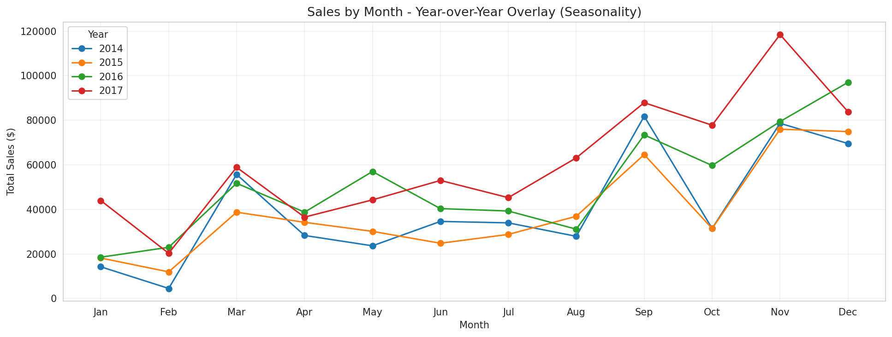
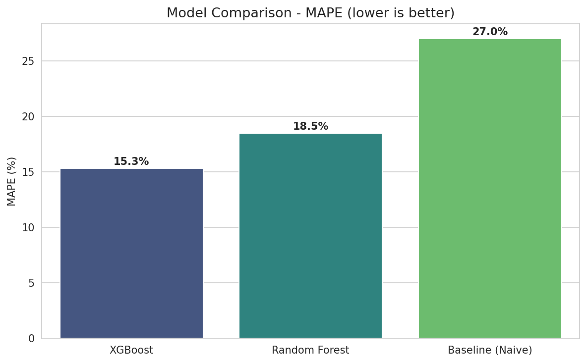
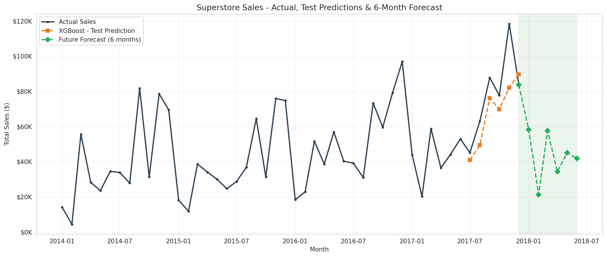

# Sales & Demand Forecasting for Businesses

> **Machine Learning Internship - Task 1** | Future Interns (Track: ML)

A machine learning project that forecasts monthly retail sales from historical
data and turns the predictions into clear, business-ready insights - the kind a
store owner, startup founder, or business manager could actually use to plan
inventory, staffing, and cash flow.

---

## Author

**Rohit Kumar Malik** - AI & Cybersecurity Graduate

[LinkedIn](https://www.linkedin.com/in/rohitmalik7) · [GitHub](https://github.com/RohitMalik7) · rohitmalik180904@gmail.com

---

## Overview

The goal of this project is not just to train an accurate model, but to build
something genuinely useful for a business. Using four years of retail sales
data, I built a forecasting pipeline that:

- learns the underlying **trend and seasonality** in the data,
- predicts the **next 6 months** of sales, and
- explains what the forecast means and how a business can act on it.

The final model (XGBoost) forecasts monthly sales with an average error of about
**15%**, a clear improvement over a naive baseline (~27%).

---

## Dataset

| Property | Detail |
|----------|--------|
| Source | Superstore Sales Dataset (Kaggle) |
| Records | 9,994 orders |
| Time Period | January 2014 – December 2017 (4 years) |
| Region | United States (East, West, Central, South) |
| Key Columns | Order Date, Sales, Region, Category, Sub-Category, Segment, Profit |
| Data Quality | No missing values, no duplicate rows |

The data shows a clear upward sales trend and strong yearly seasonality - sales
consistently peak in Q4 (September, November, December) and dip in February.

---

## Approach

1. **Aggregation** - collapsed 9,994 daily orders into a monthly sales time series.
2. **EDA & Decomposition** - explored the trend and seasonality, and split the
   series into trend + seasonal + residual components to confirm the patterns.
3. **Feature Engineering** - created calendar features (year, month, quarter),
   lag features (1, 2, 3, and 12 months), and a 3-month rolling mean.
4. **Baseline** - established a naive "last value" forecast as a benchmark to beat.
5. **Modelling** - trained Random Forest and XGBoost regressors using a
   time-based train/test split (no shuffling).
6. **Forecasting** - used the best model to recursively predict the next 6 months.
7. **Insights** - translated the forecast into plain-English business takeaways.

---

## Results

Evaluated on a held-out 6-month test set (lower is better):

| Model | MAE | RMSE | MAPE |
|-------|----:|-----:|-----:|
| **XGBoost** | **13,248** | **17,067** | **15.3%** |
| Random Forest | 15,409 | 18,301 | 18.5% |
| Baseline (Naive) | 22,616 | 25,642 | 27.0% |

Both machine learning models beat the baseline. The feature-importance analysis
shows the model relies most heavily on `lag_12` (same month last year) and the
month number - confirming it genuinely learned the yearly seasonality.

---

## Key Visualizations

**Year-over-Year Seasonality**


**Model Comparison**


**Final Forecast (Actual vs Predicted + 6-Month Forecast)**


> An interactive version of the forecast is available at
> [`reports/figures/interactive_forecast.html`](reports/figures/interactive_forecast.html)
> (download and open in a browser, as GitHub does not render interactive HTML inline).

---

## Business Insights

- **Sales are growing year-over-year**, so the business should plan for continued, gradual growth.
- **Seasonality is strong and reliable** - peaks in Q4, lowest point in February every year.
- **The West region and Technology category drive the most revenue** - prime focus areas.
- **Heavy discounts hurt profit** - some orders run at a loss, so discounting deserves review.

**Recommended actions:** build inventory and staffing ahead of Q4, run promotions
in the slow February period, and prioritize the West region and Technology line in
growth planning.

---

## Project Structure

```
FUTURE_ML_01/
├── data/
│   ├── raw/                  # original dataset (untouched)
│   └── processed/            # cleaned & aggregated data
├── notebooks/
│   └── sales_forecasting.ipynb
├── reports/
│   └── figures/              # exported charts + interactive forecast
├── README.md
├── requirements.txt
└── .gitignore
```

---

## How to Run

1. Clone the repository:
   ```bash
   git clone https://github.com/RohitMalik7/FUTURE_ML_01.git
   cd FUTURE_ML_01
   ```
2. Install the dependencies:
   ```bash
   pip install -r requirements.txt
   ```
3. Open `notebooks/sales_forecasting.ipynb` in Jupyter or Google Colab and run
   the cells top to bottom.

---

## Tech Stack

Python · pandas · NumPy · scikit-learn · XGBoost · statsmodels · Matplotlib · Seaborn · Plotly

---

*Built as part of the Future Interns Machine Learning Internship (Task 1).*
